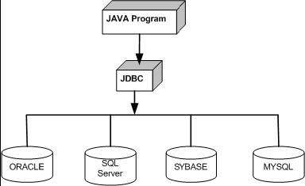
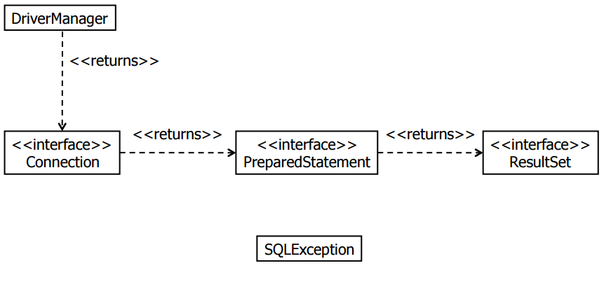
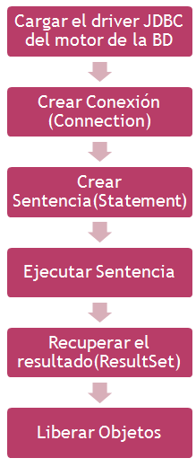
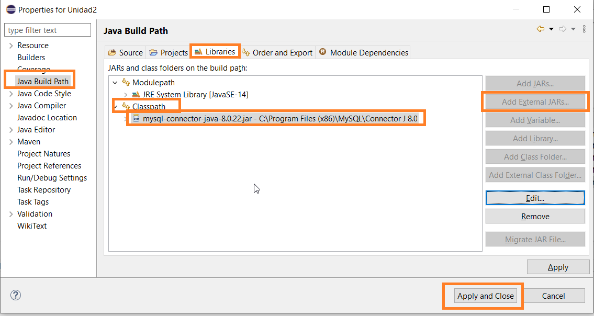
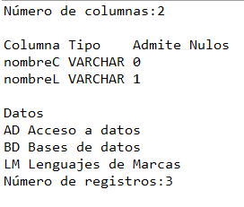
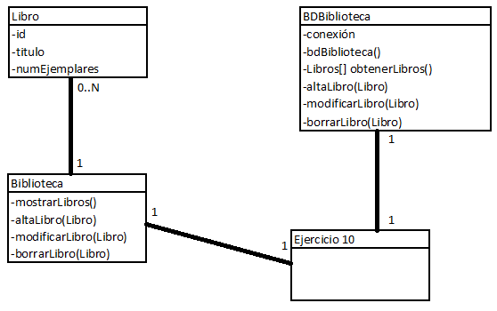
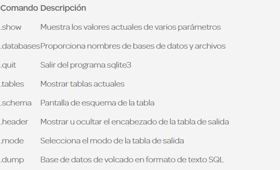
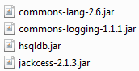
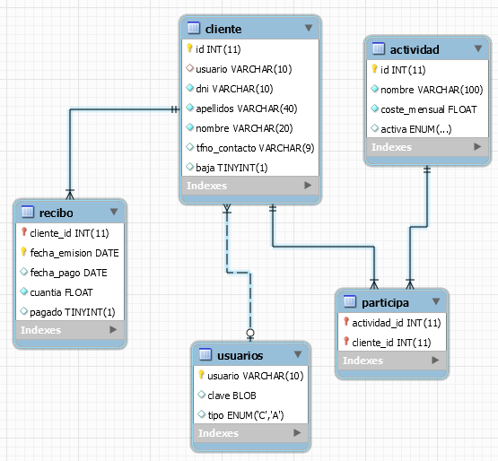

# Tema 2: Manejo de Conectores — Acceso a Datos
## Versión actualizada (JDBC moderno, *connection pooling*, seguridad, transacciones, DAO)

> Apuntes del Tema 2, revisados e integrados con contenidos actuales de JDBC (registro automático de drivers, *pools* de conexión, prevención de inyección SQL, patrón DAO y fundamentos de transacciones).

---

## Índice

1. El desfase objeto-relacional
2. Gestores embebidos e independientes
3. Protocolos de acceso a BD SQL
4. Conector JDBC
   - 4.1 Clases del paquete `java.sql`
   - 4.2 Pasos para acceder a una BD
   - 4.3 Acceso a BD MySQL
   - 4.4 *Connection pooling*
5. Metadatos
6. Ejecución de sentencias DML/DDL
7. Sentencias preparadas y seguridad (inyección SQL)
8. Consultas y tratamiento del `ResultSet`
9. Ejecución de scripts
10. Rutinas almacenadas en el servidor
11. Transacciones
12. SQLite
13. Acceso a BD Access
14. Cierre de recursos y patrón DAO
15. Ejercicio integrador: gestión de un gimnasio
16. Glosario

---

## 1 El desfase objeto-relacional

El término **desfase o impedancia objeto-relacional** se refiere a las dificultades técnicas que surgen cuando una base de datos relacional se usa en conjunto con un programa escrito en programación orientada a objetos (POO). Se manifiesta en varios frentes:

| Problema | En objetos (Java) | En relacional (SQL) |
|---|---|---|
| **Lenguaje** | El programador debe dominar POO y el lenguaje de acceso a datos a la vez | — |
| **Identidad** | Cada objeto tiene una identidad de memoria (referencia) | Cada fila se identifica por su clave primaria (un valor, no una referencia) |
| **Tipos de datos** | Tipos complejos, sin restricciones fuertes | Tipos con restricciones estrictas (longitud, dominio...) |
| **Herencia** | Una clase puede heredar de otra | No existe herencia nativa entre tablas |
| **Relaciones/colecciones** | Un objeto puede tener una `List` como atributo | Las relaciones se representan con claves foráneas entre tablas separadas |
| **Paradigma** | Modelo de clases | Modelo Entidad-Relación (tablas y tuplas) |

En el proceso de diseño y construcción del software hay que traducir el modelo orientado a objetos al modelo E/R, lo que obliga a diseñar dos representaciones distintas para la misma aplicación.

> **Analogía**: es como traducir un poema entre dos idiomas con estructuras gramaticales muy distintas. Puedes traducir el significado, pero la forma nunca encaja perfectamente "palabra a palabra". En esta unidad ese "traductor" lo escribimos nosotros mismos, sentencia SQL a sentencia SQL; con un ORM (tema posterior), buena parte de esa traducción se automatiza.

> **Error común**: diseñar las clases Java "calcando" mentalmente la tabla (una clase por tabla, un atributo por columna, sin más) y pensar solo en el modelo relacional al programar. Es más productivo diseñar primero el modelo de objetos que tiene sentido para la aplicación y resolver conscientemente el mapeo hacia las tablas.

## 2 Gestores embebidos e independientes

Antes de hablar del conector, conviene distinguir dos formas de desplegar un SGBD:

| | Gestor embebido | Gestor independiente |
|---|---|---|
| **Dónde se ejecuta** | Dentro del mismo proceso que la aplicación | En un servidor aparte (misma máquina u otra) |
| **Ejemplos** | SQLite, H2, Apache Derby | MySQL, MariaDB, PostgreSQL, Oracle, SQL Server, Access* |
| **Instalación** | Ninguna, el fichero de BD viaja con la app | Requiere instalar y administrar un servidor |
| **Concurrencia multiusuario en red** | Muy limitada o inexistente | Diseñado para ello |
| **Casos de uso típicos** | Apps de escritorio/móviles, pruebas, prototipos | Aplicaciones cliente-servidor, web, empresariales |

*Access no es un servidor en sentido estricto, pero funciona como fichero local igual que SQLite, por lo que se comporta como embebido a efectos prácticos.

**Ventajas e inconvenientes**

- **Embebido**: cero configuración de servidor y arranque instantáneo (✅); escalabilidad y concurrencia muy limitadas (❌).
- **Independiente**: alta concurrencia, administración avanzada, replicación, copias de seguridad centralizadas (✅); requiere instalación y mantenimiento, añade latencia de red (❌).

## 3 Protocolos de acceso a BD SQL

Las aplicaciones usan APIs para abrir una conexión a una BD, enviar consultas, actualizaciones y recibir resultados. Las más usadas son:

- **ODBC** (Open Database Connectivity): conector de Microsoft, estándar para acceder a cualquier BD desde aplicaciones Windows. Complejo de usar desde Java, con problemas de seguridad, robustez y portabilidad al estar escrito en C.
- **JDBC** (Java Database Connectivity): API estándar de Java (un conjunto de interfaces: `Connection`, `Statement`, `ResultSet`...) que define *cómo* debe comunicarse un programa Java con cualquier BD relacional, sin importar el fabricante. Cada SGBD proporciona su propia implementación en forma de **driver** (una librería `.jar`).



> **Analogía**: JDBC es como un enchufe universal de viaje. El enchufe (la API JDBC) es siempre igual desde el punto de vista del aparato (tu programa Java), pero necesitas el adaptador correcto (el driver) según el país (el SGBD): uno para MySQL, otro para PostgreSQL, otro para SQLite... El programa apenas cambia entre un SGBD y otro; solo cambian la URL de conexión y el driver.

## 4 Conector JDBC

Para poder conectarse a una base de datos y lanzar consultas, una aplicación necesita un driver adecuado: un conjunto de clases que implementan los interfaces de la API JDBC y acceden a la base de datos. El conector lo proporciona el fabricante de la base de datos o bien un tercero.

### 4.1 Clases del paquete `java.sql`

Las clases para operar con BD a través de JDBC se encuentran en el paquete **java.sql**:

- **DriverManager**: gestiona todos los drivers instalados.
- **Connection**: representa una conexión a una BD.
- **DatabaseMetaData**: proporciona información (metadatos) acerca de una BD.
- **Statement**: ejecuta sentencias SQL sin parámetros.
- **PreparedStatement**: ejecuta sentencias SQL con parámetros.
- **CallableStatement**: ejecuta sentencias SQL con parámetros de e/s como procedimientos almacenados.
- **ResultSet**: contiene las filas resultantes de una consulta.
- **ResultSetMetaData**: obtiene información (metadatos) sobre un ResultSet.



### 4.2 Pasos para acceder a una BD



**Ejemplo completo y actualizado**

```java
import java.sql.*;

public class ConexionBD {

    private static final String URL = "jdbc:mysql://localhost:3306/ies?serverTimezone=Europe/Madrid";
    private static final String USUARIO = "root";
    private static final String CLAVE = "root";

    public static void main(String[] args) {

        // 1. Cargar el driver: YA NO ES NECESARIO Class.forName() (ver aviso más abajo)

        // 2-6. Conexión, sentencia, ejecución, resultado y cierre, con try-with-resources
        String query = "select * from alumnos";

        try (Connection conexion = DriverManager.getConnection(URL, USUARIO, CLAVE);
             Statement sentencia = conexion.createStatement();
             ResultSet resultado = sentencia.executeQuery(query)) {

            while (resultado.next()) {
                System.out.println("ID:" + resultado.getInt(1)
                        + "\tNOMBRE:" + resultado.getString("nombre")
                        + "\tCURSO:" + resultado.getString(3));
            }
        } catch (SQLException e) {
            System.err.println("Error de acceso a la base de datos: " + e.getMessage());
        }
        // Connection, Statement y ResultSet se cierran automáticamente, en orden inverso
    }
}
```

> **Aviso importante — `Class.forName()` ya no es obligatorio**: en versiones antiguas de JDBC (anteriores a JDBC 4.0 / Java 6, año 2006) era obligatorio escribir `Class.forName("com.mysql.cj.jdbc.Driver")` al principio del programa para forzar la carga de la clase del driver. Hoy en día los drivers modernos se registran automáticamente mediante el mecanismo `ServiceLoader` de Java, así que ese paso puede omitirse. **Sigue apareciendo en mucho código y tutoriales antiguos**: si lo ves, no es un error, simplemente es una precaución que ya no hace falta.

**Anatomía de la URL de conexión**: `jdbc:<subprotocolo>://<host>:<puerto>/<nombre_bd>?<parámetros_opcionales>`. Por ejemplo, para PostgreSQL sería `jdbc:postgresql://localhost:5432/ies`, y para SQLite (embebido, sin host ni puerto, apunta a un fichero) `jdbc:sqlite:alumnos.db`.

### 4.3 Acceso a BD MySQL

Vamos a preparar el entorno para poder acceder desde los programas Java a BD MySQL con JDBC:

- Instalar **Servidor MySQL** (XAMPP o directamente el servidor).
- Instalar **MySQL Workbench**.
- Obtener el driver del conector JDBC. La forma recomendada y más portable es **Maven** (evita depender de rutas concretas de un PC o de un IDE):

```xml
<!-- https://mvnrepository.com/artifact/com.mysql/mysql-connector-j -->
<dependency>
    <groupId>com.mysql</groupId>
    <artifactId>mysql-connector-j</artifactId>
    <version>8.4.0</version>
</dependency>
```

Si no se usa Maven, se puede añadir el `.jar` manualmente al *Build Path* del proyecto (`Project/Properties/Java Build Path/Libraries/Classpath/Add External Jar`):



> **Ejercicio 1**: Crea una clase Java que gestione el acceso a los datos de la BD alumnos. Realiza un programa en Java que muestre los datos de la tabla alumnos, usando `try-with-resources`.

### 4.4 *Connection pooling*

Abrir una conexión a un SGBD independiente es una operación **relativamente costosa** (negociación de red, autenticación...). Si una aplicación abre y cierra una conexión nueva por cada operación, el rendimiento se resiente, sobre todo en aplicaciones con muchas peticiones concurrentes. La solución es un **pool de conexiones**: un conjunto de conexiones ya abiertas y "listas para usar" que se reutilizan, en lugar de crearlas y destruirlas constantemente.

```java
import com.zaxxer.hikari.HikariConfig;
import com.zaxxer.hikari.HikariDataSource;
import java.sql.Connection;
import java.sql.SQLException;

public class PoolConexiones {

    private static final HikariDataSource dataSource;

    static {
        HikariConfig config = new HikariConfig();
        config.setJdbcUrl("jdbc:mysql://localhost:3306/ies");
        config.setUsername("root");
        config.setPassword("root");
        config.setMaximumPoolSize(10); // máximo de conexiones simultáneas en el pool
        dataSource = new HikariDataSource(config);
    }

    public static Connection obtenerConexion() throws SQLException {
        return dataSource.getConnection(); // "presta" una conexión del pool
    }
}
```

**HikariCP** es actualmente el pool de conexiones de referencia en el ecosistema Java. Para empezar, basta con entender el concepto y ver una demostración; la implementación completa puede dejarse como contenido de ampliación.

> **Analogía**: es como una flota de taxis en una parada, en vez de fabricar un taxi nuevo cada vez que alguien lo necesita (crear una conexión) y "desguazarlo" al llegar (cerrarla). Los taxis (conexiones) esperan en la parada (el pool), se cogen cuando hacen falta y, al terminar el trayecto, vuelven a la parada para el siguiente cliente.

> **Error común**: no cerrar nunca las conexiones obtenidas de un pool. Cuando se usa un pool, `close()` **no destruye la conexión física**, sino que la devuelve al pool para que otro la reutilice. Si se olvida `close()`, la conexión queda "prestada" indefinidamente y el pool acaba agotándose, aunque parezca que "no se ha cerrado nada".

## 5 Metadatos

### A nivel BD, tabla, campo

Para obtener los metadatos de la BD utilizamos la interfaz **DatabaseMetaData**.

```java
DatabaseMetaData datos = conexion.getMetaData();

System.out.println(""+datos.getDatabaseProductName());
ResultSet tablas = datos.getTables(null, null, null, null);
while(tablas.next()) {
    System.out.println(tablas.getString(3));
}
ResultSet campos = datos.getColumns(null, null, "libros", null);
while(campos.next()) {
    System.out.println("---"+campos.getString(4));
}
```

Métodos más usados: `getDatabaseProductName()`, `getDriverName()`, `getUrl()`, `getUserName()`, `getTables()`, `getColumns()`, `getPrimaryKeys()`, `getImportedKeys()`, `getProcedures()`.

### A nivel de resultado de consulta

Para obtener los metadatos de los datos devueltos en una consulta utilizamos la interfaz **ResultSetMetaData**.

```java
Statement consulta = conexion.createStatement();
ResultSet resultado = consulta.executeQuery("select * from libros");
ResultSetMetaData datosConsulta = resultado.getMetaData();
for(int i=1; i<=datosConsulta.getColumnCount(); i++) {
    System.out.println("Campo:"+datosConsulta.getColumnName(i));
    System.out.println("Tipo:"+datosConsulta.getColumnTypeName(i));
}
```

Métodos más usados: `getColumnCount()`, `getColumnName()`, `getColumnTypeName()`, `isNullable()`.

> **Ejercicio 2**: Utilizando la clase Alumno, realiza un programa que muestre: gestor de base de datos, nombre del driver, URL, usuario y, para cada tabla, su nombre, clave primaria, claves externas y, de cada campo, su nombre y tipo.

> **Ejercicio 3**: Muestra los datos de la tabla asignatura con el número de columnas, su tipo y si admiten nulos, seguido de los datos y el número de registros.



## 6 Ejecución de sentencias DML/DDL

`Statement` sirve para sentencias **sin parámetros variables**, típicamente DDL (`CREATE`, `ALTER`, `DROP`). Para DML con datos que varían (por ejemplo, insertar lo que ha escrito el usuario) se debe usar `PreparedStatement` (apartado 7), tanto por seguridad como por rendimiento.

| Método | Uso |
|---|---|
| `ResultSet executeQuery(String)` | Cuando la sentencia devuelve un conjunto de filas (`SELECT`) |
| `int executeUpdate(String)` | Cuando no devuelve filas: para DDL (`create`, `drop`, `alter`) devuelve 0; para DML (`insert`, `update`, `delete`) devuelve el número de registros afectados |
| `boolean execute(String)` | Para cualquier tipo de sentencia. Devuelve `true` si se obtiene un `ResultSet` y `false` en caso contrario |

> **Nota**: `executeUpdate()` no es solo para `UPDATE`; su nombre puede despistar. Sirve para cualquier sentencia que modifique datos o estructura (`INSERT`, `UPDATE`, `DELETE`, `CREATE TABLE`...). Si se intenta usar `executeQuery()` con un `INSERT`, se obtiene una excepción.

**Ejemplo con `PreparedStatement` y clave generada**

```java
public int insertarProducto(Connection conexion, String nombre, double precio, int stock) throws SQLException {
    String sql = "INSERT INTO productos (nombre, precio, stock) VALUES (?, ?, ?)";

    try (PreparedStatement ps = conexion.prepareStatement(sql, Statement.RETURN_GENERATED_KEYS)) {
        ps.setString(1, nombre);
        ps.setDouble(2, precio);
        ps.setInt(3, stock);

        int filasAfectadas = ps.executeUpdate();
        if (filasAfectadas == 0) {
            throw new SQLException("La inserción no afectó a ninguna fila.");
        }

        try (ResultSet clavesGeneradas = ps.getGeneratedKeys()) {
            if (clavesGeneradas.next()) {
                return clavesGeneradas.getInt(1); // id autogenerado
            }
            throw new SQLException("No se pudo obtener el id generado.");
        }
    }
}
```

> **Error común**: concatenar directamente los valores en la cadena SQL en vez de usar parámetros (`"INSERT INTO productos VALUES ('" + nombre + "', ...)"`). Además del riesgo de inyección SQL (apartado 7), esto rompe con datos que contienen comillas simples (`Funda 6.1'' para móvil`), provocando errores de sintaxis en pleno funcionamiento.

> **Ejercicio 4**: Realiza un programa que muestre un menú con las siguientes opciones:
> 1. **Alumnos por asignatura**: mostrar nombre de alumnos, asignatura y nota de una asignatura pedida por teclado. No usar consultas con parámetros.
> 2. **Notas de alumno**: mostrar asignatura y nota de un alumno cuyo id se pide por teclado. Usar consultas con parámetros.
> 3. **Alta de alumno**: insértate como alumno de 2DAM.
> 4. **Añadir cp**: añade a la tabla alumno el campo cp de tipo entero.
> 5. **Rellenar cp**: rellena el cp de los alumnos con 10300.
> 6. **Añadir fecha de nacimiento**: añade a la tabla alumno el campo correspondiente.
> 7. **Rellenar fecha de nacimiento**: rellena la fecha de nacimiento de un alumno cuyo id se pide por teclado con la fecha que también se pide por teclado.

## 7 Sentencias preparadas y seguridad (inyección SQL)

### 7.1 El problema: inyección SQL

La **inyección SQL** es una de las vulnerabilidades más conocidas y peligrosas en aplicaciones que acceden a bases de datos. Ocurre cuando se construye una sentencia SQL **concatenando directamente** una entrada proporcionada por el usuario, permitiendo que ese usuario "inyecte" código SQL no previsto.

```java
// ❌ CÓDIGO VULNERABLE — NUNCA HACER ESTO
String nombreBuscado = entradaUsuario;
String sql = "SELECT * FROM clientes WHERE nombre = '" + nombreBuscado + "'";
Statement st = conexion.createStatement();
ResultSet rs = st.executeQuery(sql);
```

Si un usuario malicioso introduce como "nombre" el valor `' OR '1'='1`, la sentencia final ejecutada sería:

```sql
SELECT * FROM clientes WHERE nombre = '' OR '1'='1'
```

Esta condición es **siempre verdadera**, por lo que la consulta devolvería **todos los clientes**, saltándose el filtro previsto. Con técnicas más avanzadas (`; DROP TABLE clientes; --`) se podrían borrar tablas completas o extraer datos confidenciales.

> **Analogía**: es como si en un formulario de "escribe tu nombre" para entrar a una fiesta privada, alguien escribiera una frase que, leída literalmente por el portero, sonara como *"...o déjame pasar a cualquiera"*. El portero (la base de datos) obedece la orden que recibe si no distingue entre "el nombre del invitado" y "una instrucción".

### 7.2 La solución: `PreparedStatement`

```java
// ✅ CÓDIGO SEGURO
String sql = "SELECT * FROM clientes WHERE nombre = ?";
try (PreparedStatement ps = conexion.prepareStatement(sql)) {
    ps.setString(1, nombreBuscado); // el valor SIEMPRE se trata como dato, nunca como código SQL
    try (ResultSet rs = ps.executeQuery()) {
        // ...
    }
}
```

`PreparedStatement` permite construir una sentencia con marcadores (`?`) que se sustituyen por datos al ejecutar la sentencia. Cada marcador tiene un número de orden empezando en 1, y solo se puede usar para datos de columnas, nunca para nombres de tablas o columnas. Se rellenan con `sentencia.setTipo(nº orden, valor)`.

Con `PreparedStatement`, la sentencia se envía **precompilada** al SGBD con "huecos" reservados para los parámetros. El motor conoce desde el principio la estructura exacta de la consulta y trata cualquier valor proporcionado después como **dato literal**, nunca como código SQL ejecutable.

**`Statement` vs. `PreparedStatement`**

| | `Statement` | `PreparedStatement` |
|---|---|---|
| Seguridad frente a inyección SQL | Ninguna si se concatenan datos | Total, por diseño |
| Rendimiento en ejecuciones repetidas | Se recompila cada vez | El SGBD puede reutilizar el plan compilado |
| Uso recomendado | Solo DDL fijo, sin datos de usuario | Siempre que intervenga un valor variable |

> **Dato importante**: según los informes anuales del **OWASP Top 10** (catálogo de referencia mundial de riesgos de seguridad web), los fallos de inyección llevan más de una década entre las categorías de riesgo más críticas. No es una amenaza "de laboratorio": ha causado fugas de datos masivas en empresas reales. Usar `PreparedStatement` de forma sistemática es una competencia profesional de seguridad básica, no un capricho académico.

> **Error común**: pensar que basta con "escapar" manualmente las comillas del texto (sustituir `'` por `''`) en vez de usar `PreparedStatement`. Es una técnica frágil que no cubre todos los vectores de ataque posibles. `PreparedStatement` no es "una opción más segura", es la solución correcta y estándar.

## 8 Consultas y tratamiento del `ResultSet`

Un `ResultSet` representa la tabla de resultados de una consulta `SELECT`. Se comporta como un **cursor**: apunta inicialmente *antes* de la primera fila, y hay que llamar a `next()` para avanzar fila a fila (recorrido secuencial hacia adelante por defecto — el mismo concepto de acceso secuencial visto con ficheros, aplicado a un conjunto de resultados).

```java
public void procesarResultado(Statement sentencia) throws SQLException {
    ResultSet resultado = sentencia.getResultSet();
    while (resultado.next()) {
        // Recuperamos los campos de dos formas:
        // resultado.getTipo(num_columna) o resultado.getTipo(nombre_columna)
        System.out.println("ID:" + resultado.getInt(1)
                + "\tNOMBRE:" + resultado.getString("nombre")
                + "\tCURSO:" + resultado.getString(3));
    }
}
```

> **Analogía**: es como una cinta transportadora en una fábrica de embalaje. Los productos (filas) pasan uno a uno frente a ti; puedes inspeccionar el que tienes delante (`rs.getXxx()`), pero para ver el siguiente hay que "hacer avanzar la cinta" (`rs.next()`) — no se puede ver dos a la vez ni, en el modo por defecto, retroceder.

> **Dato importante**: es posible crear un `ResultSet` **desplazable** (*scrollable*) y hasta **actualizable**, indicándolo al crear el `Statement`: `conexion.prepareStatement(sql, ResultSet.TYPE_SCROLL_INSENSITIVE, ResultSet.CONCUR_UPDATABLE)`. Esto permite `rs.previous()`, `rs.first()`, `rs.absolute(n)` o incluso `rs.updateString(...)` seguido de `rs.updateRow()`. En la práctica profesional actual se usa poco (se prefiere un `UPDATE` explícito), pero conviene saber que existe, ya que recuerda al acceso aleatorio visto con ficheros.

**Errores comunes**

1. Llamar a un `getXxx()` antes de la primera llamada a `next()`, o después de que `next()` devuelva `false`: lanza `SQLException`.
2. Acceder a una columna por índice incorrecto: en JDBC los índices **empiezan en 1, no en 0**.
3. Asumir que el nombre de columna siempre es sensible a mayúsculas/minúsculas (depende del SGBD).
4. Usar el `ResultSet` después de cerrar la conexión o el `Statement` que lo generó: al cerrar el recurso "padre" con `try-with-resources`, el `ResultSet` deja de ser válido.

## 9 Ejecución de scripts

Para ejecutar un script SQL en el servidor de BD hay que indicarlo en la cadena de conexión añadiendo el modificador `allowMultiQueries=true`:

```java
Connection conexion =
    DriverManager.getConnection("jdbc:mysql://localhost/alumnos?allowMultiQueries=true","root","rosa");
```

Para cargar el script, hay que formar un String con el contenido del fichero. La forma de ejecutar la sentencia es la misma que la de las sentencias DDL. Hay que tener cuidado, ya que algunas BD no soportan la ejecución de scripts.

> **Ejercicio 5**: Realiza un script que añada a la base de datos la tabla profesor y la rellene con algunos profesores. Añade también la tabla imparte, donde se refleje qué profesor imparte cada asignatura.

## 10 Rutinas almacenadas en el servidor

Un **procedimiento almacenado** es un bloque de código SQL (con lógica, variables, control de flujo) que se define y se guarda **dentro del propio SGBD**, invocable por su nombre desde la aplicación.

JDBC permite ejecutar funciones o procedimientos. La forma de ejecutarlos es diferente, ya que las funciones tienen retorno y los procedimientos no.

**Pasos**

1. Rellenar un String con el nombre de la rutina y los parámetros:
   - Procedimientos: `"{ call nombre_proc}"` o `"{ call nombre_proc(?,?,…)}"`
   - Funciones: `"{? = call nombre_func}"` o `"{? = call nombre_func(?,?,…)}"`
2. Crear la sentencia: un objeto `CallableStatement`, con `conexion.prepareCall(consulta)`.
3. Rellenar los parámetros de entrada (igual que en `PreparedStatement`).
4. Registrar los parámetros de salida **antes de ejecutar**, indicando su tipo (`java.sql.Types.INTEGER`, `Types.VARCHAR`...):
   ```java
   sentencia.registerOutParameter(int indice, int tipo);
   ```
5. Ejecutar con `executeQuery`/`executeUpdate` según lo que devuelva la rutina.
6. Recuperar el valor devuelto: `sentencia.getTipo(indice);`

> **Ventajas e inconvenientes de los procedimientos almacenados**
> - ✅ Reducen el tráfico de red (una sola llamada en vez de varias sentencias), centralizan lógica de negocio compartida por varias aplicaciones, pueden ser más eficientes al ejecutarse cerca de los datos.
> - ❌ La lógica queda "escondida" fuera del código de la aplicación y de su control de versiones; el lenguaje procedural no es portable entre SGBD; dificulta las pruebas unitarias automatizadas.

> **Error común**: olvidar registrar el tipo del parámetro de salida con `registerOutParameter()` antes de ejecutar el procedimiento, o intentar leer el valor de salida antes de llamar a `execute()`.

> **Ejercicio 6**: Realiza un programa Java que ejecute un script que cree en MySQL las siguientes rutinas almacenadas:
> - una función `chequear_alumno(idAlumno)` que devuelva `true` si el id existe y `false` en caso contrario.
> - un procedimiento que inserte una nota a un alumno (id, asignatura, nota) y devuelva un select de las notas del alumno si se ha insertado correctamente.

> **Ejercicio 7**: Realiza un programa que pida un número de alumno por teclado y muestre si existe o no llamando a `chequear_alumno`.

> **Ejercicio 9**: Realiza un programa que pida id de alumno, asignatura y nota, e inserte el registro en la tabla notas llamando al procedimiento `notas_Asig`.

> **Ejercicio 10 — Desfase Objeto-Relacional**: a partir del siguiente diagrama de clases, realiza un programa que permita crear biblioteca, mostrar libros, dar de alta, modificar y borrar un libro.



## 11 Transacciones

### 11.1 ¿Qué es una transacción?

Una **transacción** es un conjunto de una o más operaciones sobre la base de datos que se ejecutan como **una unidad indivisible**: o se completan todas, o no se completa ninguna. Este comportamiento se resume en las propiedades **ACID** (Atomicidad, Consistencia, Aislamiento, Durabilidad).

> **Analogía**: piensa en una transferencia bancaria: quitar 100 € de tu cuenta y añadir 100 € a la de otra persona son, en realidad, dos operaciones. Si el sistema falla justo después de restarte el dinero pero antes de sumárselo al destinatario, el dinero "desaparecería". Una transacción garantiza que, ante ese fallo, ninguna de las dos operaciones se queda a medias.

### 11.2 Gestión de transacciones en JDBC

Por defecto, JDBC funciona en modo `autocommit = true`: cada sentencia se confirma automáticamente al ejecutarse. Para agrupar varias operaciones en una sola transacción hay que desactivar ese modo:

```java
public void altaClienteConSocio(Connection conexion, Cliente cliente) {
    try {
        conexion.setAutoCommit(false); // iniciamos la transacción manualmente

        // 1. Insert en la tabla cliente
        try (PreparedStatement ps1 = conexion.prepareStatement(
                "INSERT INTO cliente (usuario, dni, nombre, apellidos) VALUES (?,?,?,?)")) {
            ps1.setString(1, cliente.usuario());
            ps1.setString(2, cliente.dni());
            ps1.setString(3, cliente.nombre());
            ps1.setString(4, cliente.apellidos());
            ps1.executeUpdate();
        }

        // 2. Insert en la tabla usuarios
        try (PreparedStatement ps2 = conexion.prepareStatement(
                "INSERT INTO usuarios (usuario, clave, tipo) VALUES (?, sha2(?,256), 'C')")) {
            ps2.setString(1, cliente.usuario());
            ps2.setString(2, cliente.clave());
            ps2.executeUpdate();
        }

        conexion.commit(); // confirma TODAS las operaciones anteriores
        System.out.println("Cliente dado de alta correctamente.");

    } catch (SQLException e) {
        try {
            conexion.rollback(); // deshace TODO lo hecho desde el último commit
            System.err.println("Alta cancelada. Motivo: " + e.getMessage());
        } catch (SQLException rollbackEx) {
            System.err.println("Error crítico al hacer rollback: " + rollbackEx.getMessage());
        }
    } finally {
        try {
            conexion.setAutoCommit(true); // devolvemos la conexión a su estado habitual
        } catch (SQLException e) {
            System.err.println("Error al restaurar autocommit: " + e.getMessage());
        }
    }
}
```

> **Ventajas e inconvenientes**
> - ✅ Garantiza la integridad de operaciones compuestas por varios pasos; evita estados intermedios inconsistentes; permite deshacer de forma segura ante errores.
> - ❌ Mientras una transacción está abierta puede retener bloqueos, afectando a la concurrencia si se hace demasiado larga; añade complejidad (hay que acordarse de `commit`/`rollback`/restaurar `autocommit`); un mal diseño puede provocar interbloqueos.

> **Dato importante**: además de `commit`/`rollback` completos, JDBC permite definir puntos de guardado (`Savepoint`) dentro de una transacción con `conexion.setSavepoint()`, para deshacer solo una parte del trabajo (`conexion.rollback(savepoint)`) sin perder todo lo anterior.

**Errores comunes**

1. Olvidar `conexion.setAutoCommit(false)` y pensar que se está trabajando "en transacción" cuando cada sentencia se confirma sola.
2. No restaurar `autocommit = true` después de terminar, dejando la conexión en un estado inesperado si se reutiliza (grave si procede de un pool).
3. Hacer el `commit()` demasiado pronto (antes de comprobar todas las condiciones necesarias) o el `rollback()` demasiado tarde.

## 12 SQLite

JDBC permite conectarnos con diferentes SGBD. La forma de trabajar con las BD es independiente del SGBD.

**Instalación del SGBD SQLite**

- Descarga de https://sqlite.org/download.html (herramientas de línea de comandos).
- Descomprime el zip.
- Crea una BD en modo comando: `sqlite3 ruta_BD`. Si no existe, se crea.

**Driver JDBC de SQLite (Maven)**

```xml
<!-- https://mvnrepository.com/artifact/org.xerial/sqlite-jdbc -->
<dependency>
    <groupId>org.xerial</groupId>
    <artifactId>sqlite-jdbc</artifactId>
    <version>3.46.0.0</version>
</dependency>
```

**Establecer la conexión**

```java
Connection conexion =
    DriverManager.getConnection("jdbc:sqlite:c:\\SQLITE\\alumnos.db");
```

Admite la ejecución de múltiples consultas sin indicarlo en la cadena de conexión.

Otros comandos de `sqlite3`:



| Comando | Descripción |
|---|---|
| `.show` | Muestra los valores actuales de varios parámetros |
| `.databases` | Nombres de bases de datos y archivos |
| `.quit` | Salir del programa sqlite3 |
| `.tables` | Mostrar tablas actuales |
| `.schema` | Esquema de la tabla |
| `.header` | Mostrar u ocultar el encabezado de la tabla de salida |
| `.mode` | Selecciona el modo de la tabla de salida |
| `.dump` | Volcado de la BD en formato de texto SQL |

> **Ejercicio 11**: Crea la BD alumnos.

> **Ejercicio 12**: Realiza un programa Java que permita: crear la BD alumnos (borrar tablas y volverlas a crear), ver datos, introducir alumnos, introducir asignaturas e introducir notas.

## 13 Acceso a BD Access

**Instalación de drivers Access (UCanAccess)**

- Descargar los drivers: https://sourceforge.net/projects/ucanaccess/files/
- Descomprimir y añadir las librerías al proyecto:



**Configuración Maven**

```xml
<!-- https://mvnrepository.com/artifact/net.sf.ucanaccess/ucanaccess -->
<dependency>
    <groupId>net.sf.ucanaccess</groupId>
    <artifactId>ucanaccess</artifactId>
    <version>5.0.1</version>
</dependency>
```

**Conexión**

```java
Connection conexion =
    DriverManager.getConnection("jdbc:ucanaccess://C:\\...\\biblioteca.mdb");
```

> **Ejercicio 13**: Realiza un programa que:
> - Añada un libro a la BD `biblioteca.mdb` del tema 1 (Comedia) de la editorial 1 (Planeta). El campo autonumérico no se puede pasar. Las fechas hay que introducirlas con el formato `yyyy-mm-dd hh:mm:ss`.
> - Muestre la tabla libros de la BD `biblioteca.mdb`.

## 14 Cierre de recursos y patrón DAO

### 14.1 La jerarquía de recursos a cerrar

En una operación JDBC típica intervienen hasta tres recursos `AutoCloseable`, que deben cerrarse **en orden inverso al de apertura**: `ResultSet` → `Statement`/`PreparedStatement` → `Connection`. Cerrar el recurso "padre" cierra automáticamente los "hijos" abiertos sobre él, pero no es buena práctica depender de eso: hay que cerrarlos explícitamente, y `try-with-resources` es la herramienta ideal.

```java
public List<Alumno> listarTodos(Connection conexion) throws SQLException {
    String sql = "SELECT id, nombre, curso FROM alumnos";
    List<Alumno> alumnos = new ArrayList<>();

    try (PreparedStatement ps = conexion.prepareStatement(sql);
         ResultSet rs = ps.executeQuery()) {

        while (rs.next()) {
            alumnos.add(new Alumno(rs.getInt("id"), rs.getString("nombre"), rs.getString("curso")));
        }
    }
    return alumnos;
}
```

Fíjate en que **la `Connection` no se cierra aquí**: siguiendo el patrón habitual, se abre en una capa superior (o se obtiene del pool) y se pasa como parámetro a los métodos de acceso a datos, cerrándose en el nivel que la abrió. Esto permite reutilizar la misma conexión en varias operaciones dentro de una transacción.

### 14.2 Patrón DAO (*Data Access Object*)

Conviene encapsular todo el código JDBC de una entidad (por ejemplo, `Alumno`) dentro de una única clase (`AlumnoDAO`), de forma que el resto de la aplicación nunca escriba SQL directamente, sino que llame a métodos con nombre claro (`insertar`, `buscarPorId`, `listarPorCurso`...).

**Ventajas e inconvenientes de JDBC "puro" (sin ORM)**

- ✅ Control total y explícito sobre el SQL ejecutado; sin "magia" oculta; no añade dependencias pesadas; rendimiento máximo al no existir capas intermedias.
- ❌ Mucho código repetitivo (mapear cada columna a mano); fácil cometer errores de cierre de recursos si no se es disciplinado; un cambio en el esquema obliga a revisar manualmente el SQL disperso por el código.

> **Error común**: cerrar la conexión dentro de un método "listar" o "buscar" genérico que en realidad la recibe como parámetro desde fuera. Rompe cualquier operación posterior que intente reutilizarla (por ejemplo, dentro de una transacción con varios pasos), provocando errores de "conexión cerrada" difíciles de depurar.

> **Ejercicio (nuevo)**: Refactoriza el acceso a la tabla alumnos escrito a lo largo del tema en una clase `AlumnoDAO`, con métodos `insertar`, `actualizar`, `eliminar`, `buscarPorId`, `listarTodos`, `listarPorCurso`. La clase debe recibir la `Connection` por constructor, nunca crearla ella misma.

## 15 Ejercicio integrador: gestión de un gimnasio

Se proporciona el script `gimnasio.sql`.

Realiza una aplicación que permita gestionar el funcionamiento de un gimnasio. La aplicación contará con dos tipos de usuarios: clientes y administradores.

- **Clientes**: ver las actividades en las que está inscrito, inscribirse en una actividad, borrarse de una actividad, ver los recibos emitidos (filtrando entre pagados, no pagados y todos).
- **Administradores**: gestionar clientes (modificar, añadir, dar de baja), gestionar actividades (modificar, añadir, dar de baja), generar los recibos de un mes, marcar un recibo como pagado, y generar un informe de recibos por año (con lo cobrado a cada cliente y el total del gimnasio).

La aplicación pedirá usuario y contraseña, mostrando las operaciones según el tipo de usuario. El script crea el usuario `admin` con clave `admin`.

Las contraseñas se almacenan encriptadas con `sha2('clave', longitud)` de MySQL (longitud: 224, 256, 384, 512, o 0 equivalente a 256).

Cuando se dé de alta un cliente hay que hacer un insert en dos tablas ⇒ **usar transacciones** (ver apartado 11): `setAutoCommit(false)` antes del primer insert, `commit()` después del segundo, y `rollback()` si se produce algún error entre ambos.

Cada vez que se añadan registros deberá informarse de si se ha insertado correctamente. Para recuperar el último número asignado por MySQL en un campo auto-increment:

```java
int numero = stmt.executeUpdate(query, Statement.RETURN_GENERATED_KEYS);
ResultSet rs = stmt.getGeneratedKeys();
if (rs.next()){
    int resultado = rs.getInt(1);
}
```

Para gestionar los recibos se pedirá el mes y el año; si ya se han generado se mostrarán, si no, se generarán (rutina `generar_recibos()`). Al pagar un recibo, la fecha de pago se rellena automáticamente con la fecha del día.

**Modelo entidad-relación de la BD del gimnasio:**



| Tabla | Campos |
|---|---|
| **cliente** | `id` INT(11) (PK), `usuario` VARCHAR(10), `dni` VARCHAR(10), `apellidos` VARCHAR(40), `nombre` VARCHAR(20), `tfno_contacto` VARCHAR(9), `baja` TINYINT(1) |
| **actividad** | `id` INT(11) (PK), `nombre` VARCHAR(100), `coste_mensual` FLOAT, `activa` ENUM(...) |
| **participa** | `actividad_id` INT(11), `cliente_id` INT(11) |
| **recibo** | `cliente_id` INT(11), `fecha_emision` DATE (PK compuesta), `fecha_pago` DATE, `cuantia` FLOAT, `pagado` TINYINT(1) |
| **usuarios** | `usuario` VARCHAR(10) (PK), `clave` BLOB, `tipo` ENUM('C','A') |

> **Ampliación (nuevo)**: implementa toda la conexión a base de datos a través de un *pool* de conexiones (apartado 4.4), organiza el acceso a datos en clases DAO por entidad (apartado 14.2) y usa `PreparedStatement` en absolutamente todas las sentencias con datos variables (apartado 7).

## 16 Glosario

- **ACID**: conjunto de propiedades (Atomicidad, Consistencia, Aislamiento, Durabilidad) que garantiza una transacción bien gestionada.
- **Autocommit**: modo por defecto de JDBC en el que cada sentencia se confirma automáticamente al ejecutarse.
- **Connection pooling**: técnica de reutilización de un conjunto de conexiones ya abiertas, evitando el coste de crearlas y destruirlas constantemente.
- **DAO (Data Access Object)**: patrón de diseño que encapsula todo el acceso a datos de una entidad en una única clase.
- **Desfase objeto-relacional**: fricción conceptual entre el modelo de objetos de un lenguaje de programación y el modelo de tablas de una base de datos relacional.
- **Driver JDBC**: implementación concreta, proporcionada por cada fabricante de SGBD, de la API estándar JDBC.
- **Inyección SQL**: vulnerabilidad que permite a un atacante alterar el significado de una sentencia SQL insertando código no previsto a través de una entrada de datos.
- **Gestor embebido**: SGBD que vive dentro del mismo proceso que la aplicación (SQLite, H2), sin servidor aparte.
- **Gestor independiente**: SGBD que se ejecuta como servidor aparte (MySQL, PostgreSQL), pensado para concurrencia multiusuario.
- **PreparedStatement**: sentencia SQL precompilada con parámetros, que trata cualquier valor proporcionado como dato literal, nunca como código ejecutable.
- **Procedimiento almacenado**: bloque de lógica SQL guardado y ejecutado dentro del propio SGBD, invocable por su nombre.
- **ResultSet**: objeto que representa, como un cursor de recorrido secuencial, el conjunto de filas devuelto por una consulta `SELECT`.
- **Rollback**: operación que deshace todas las modificaciones realizadas desde el último `commit` de una transacción.
- **Savepoint**: punto de guardado intermedio dentro de una transacción hasta el cual se puede deshacer parcialmente el trabajo realizado.
