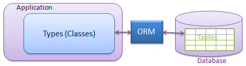
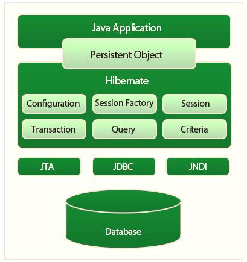
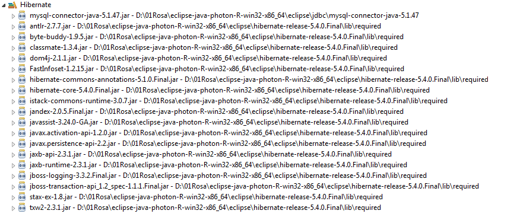
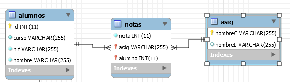
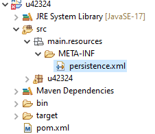
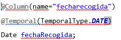
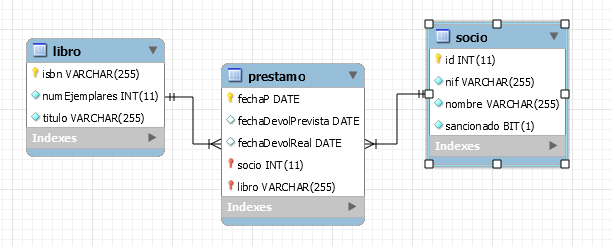
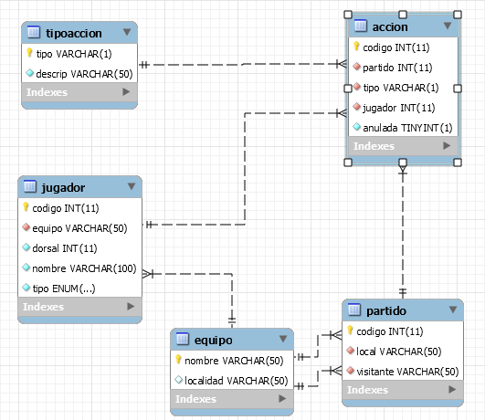
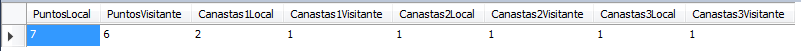

# Tema 3: Herramientas de Mapeo Objeto-Relacional — Acceso a Datos
## Versión actualizada (Jakarta Persistence, *dirty checking*, LAZY/EAGER y problema N+1, comparación con JDBC)

> Apuntes revisados e integrados con contenidos actuales de JPA/Hibernate. **Corrección importante**: los ejemplos originales usaban el paquete `javax.persistence`, incompatible con la versión de Hibernate (6.x) indicada en el propio documento; en esta versión se usa `jakarta.persistence` en todo el contenido, que es el paquete correcto desde Hibernate 6.

---

## Índice

1. ORM (Object Relational Mapping)
2. JPA y Hibernate: especificación e implementación
3. Instalación y configuración
   - 3.1 Dependencias Maven
   - 3.2 Fichero de configuración `persistence.xml`
   - 3.3 Establecimiento de conexión a la BD
4. BD alumnos
5. Mapeo de entidades mediante anotaciones
6. Estados de un objeto en una sesión JPA
7. Operaciones CRUD
8. Relaciones entre entidades
   - 8.1 Claves primarias compuestas
   - 8.2 Uno a muchos bidireccional
   - 8.3 Uno a uno
   - 8.4 Muchos a muchos
   - 8.5 Estrategias de carga (LAZY/EAGER) y el problema N+1
9. Consultas: JPQL/HQL y SQL nativo
   - 9.1 Join y `JOIN FETCH`
   - 9.2 Consultas estáticas (`@NamedQuery`)
   - 9.3 Consultas dinámicas
   - 9.4 Consultas nativas SQL
10. Transacciones con JPA
11. JDBC vs. ORM: valoración comparada
12. Proyecto: Biblioteca
13. Proyecto: Liga de baloncesto
14. Glosario

---

## 1 ORM (Object Relational Mapping)



Las herramientas **ORM** transforman representaciones de datos de SGBD relacionales a representaciones de objetos: por cada tabla de la BD se genera una clase Java, y cada registro de la tabla es un objeto de dicha clase. Las relaciones se transforman en atributos de las clases relacionadas.

```
Tablas     → Clases
Registros  → Objetos
Relaciones → Atributos
```

En la transformación se crea una BD orientada a objetos "virtual" sobre la BD relacional, lo que posibilita usar las características del paradigma OO independientemente del SGBD usado. Normalmente los ORM incorporan un lenguaje de consultas OO propio e independiente del SGBD.

**Ventajas**: reducción del tiempo de desarrollo y del coste de mantenimiento; abstracción de la BD; reutilización; independencia del SGBD; portabilidad y escalabilidad del software.

**Inconveniente**: las aplicaciones pueden volverse más lentas, ya que las consultas deben traducirse del lenguaje propio de la herramienta al lenguaje del SGBD.

Existen multitud de herramientas ORM. Nosotros utilizaremos **Hibernate** para Java (**NHibernate** para .NET). Otras herramientas son **ADOdb Active Record** (PHP) y **LINQ** (.NET).

> **Analogía**: en el Tema 2 escribíamos, sentencia a sentencia, todo el SQL necesario para insertar un producto o recorrer un `ResultSet` transformándolo a mano en objetos. Un ORM es como tener un **asistente bilingüe**: tú le hablas siempre en tu idioma (objetos Java: `guardar(producto)`, `producto.setStock(10)`), y es él quien traduce al idioma del SGBD (SQL) y trae la respuesta ya traducida de vuelta. Ya no hace falta "hablar" SQL para el día a día, aunque sigue siendo imprescindible entenderlo, porque a veces el asistente traduce de forma poco eficiente y hay que corregirlo (apartado 11).

## 2 JPA y Hibernate: especificación e implementación

Es fundamental distinguir estos dos conceptos, muy habituales en el ecosistema Java:

- **JPA (Jakarta Persistence API)** es una **especificación**: un conjunto de interfaces y anotaciones estándar (`@Entity`, `EntityManager`...) que define *qué* debe poder hacer un ORM en Java, sin implementar nada por sí misma.
- **Hibernate** es la implementación de JPA más extendida (no la única; existen otras como EclipseLink). Es el motor real que genera el SQL y se comunica con el SGBD por debajo, **usando JDBC internamente** — el ORM no sustituye a JDBC (Tema 2), se apoya en él.



Hibernate usa otras librerías, como **JDBC**, **Java Transaction API (JTA)** y **Java Naming and Directory Interface (JNDI)**. JDBC realiza la conexión con el SGBD; JNDI y JTA permiten la integración de Hibernate con servidores de aplicación J2EE. El lenguaje de consulta propio de Hibernate es **HQL**.

> **Dato importante**: Hibernate nació en 2001, **antes** de que existiera la propia especificación JPA (2006). Fue precisamente el éxito de Hibernate (y de otros ORM similares de la época) lo que llevó a estandarizar sus ideas en una API oficial para todo el ecosistema Java. Por eso, aunque hoy se programa "contra JPA" por portabilidad, Hibernate añade funcionalidades propias que van más allá del estándar, accesibles mediante su API nativa cuando JPA se queda corta.

> **⚠️ Aviso importante — el paquete correcto es `jakarta.persistence`, no `javax.persistence`**: hasta Java EE 8, la API de persistencia vivía en el paquete `javax.persistence`. Al ceder Java EE a la Eclipse Foundation (pasando a llamarse **Jakarta EE**), todos los paquetes `javax.*` relacionados se renombraron a `jakarta.*`. **Desde Hibernate 6 (la versión usada en este tema), solo existe la variante `jakarta.persistence`**. Si ves código con `import javax.persistence.*` en tutoriales o documentación antigua, es de una versión anterior a Hibernate 6 y no compilará con las dependencias actuales.

### Ventajas e inconvenientes generales de usar un ORM

- ✅ Reduce drásticamente el código repetitivo; mapeo de relaciones automático; portabilidad razonable entre SGBD (basta con cambiar el *dialecto*); caché de primer nivel que puede mejorar el rendimiento; consultas orientadas a objetos más mantenibles.
- ❌ Curva de aprendizaje inicial (sesión, estados, *fetch*...); riesgo de generar SQL poco eficiente si no se entiende bien lo que ocurre por debajo (problema **N+1**, apartado 8.5); menos control fino sobre el SQL exacto ejecutado; para operaciones masivas o muy específicas, a veces sigue siendo mejor recurrir a SQL nativo o a JDBC puro.

> **Error común**: pensar que un ORM elimina la necesidad de saber SQL o de entender el modelo relacional. Es justo lo contrario: **para usar bien un ORM hace falta entender aún mejor qué SQL se está generando por debajo**, precisamente para detectar cuándo el mapeo automático no es eficiente y corregirlo.

## 3 Instalación y configuración

### 3.1 Dependencias Maven

```xml
<dependencies>
    <!-- API estándar JPA (Jakarta) -->
    <dependency>
        <groupId>jakarta.persistence</groupId>
        <artifactId>jakarta.persistence-api</artifactId>
        <version>3.1.0</version>
    </dependency>

    <!-- Implementación: Hibernate -->
    <dependency>
        <groupId>org.hibernate.orm</groupId>
        <artifactId>hibernate-core</artifactId>
        <version>6.4.1.Final</version>
    </dependency>

    <!-- Driver JDBC del SGBD (Hibernate lo usa por debajo) -->
    <dependency>
        <groupId>com.mysql</groupId>
        <artifactId>mysql-connector-j</artifactId>
        <version>8.4.0</version>
    </dependency>
</dependencies>
```

**Sin Maven**: crear una librería de usuario con las librerías de Hibernate de la carpeta `lib/required` de la distribución descargada de http://hibernate.org/orm/releases/, más el conector JDBC del SGBD que se vaya a usar.



### 3.2 Fichero de configuración `persistence.xml`

Todo proyecto debe tener un fichero de configuración que indique los datos necesarios para la conexión con la BD. Este fichero se debe llamar **persistence.xml** y se debe almacenar en `src/main/resources/META-INF/`.

```xml
<?xml version="1.0" encoding="UTF-8"?>
<persistence xmlns="https://jakarta.ee/xml/ns/persistence" version="3.1">

    <persistence-unit name="UPAlumnos" transaction-type="RESOURCE_LOCAL">
        <provider>org.hibernate.jpa.HibernatePersistenceProvider</provider>

        <!-- Representamos las clases / Opcional, si no se ponen se mapean todas -->
        <class>paquete.alumno</class>
        <!-- Solamente se mapean las clases representadas con class -->
        <exclude-unlisted-classes>true</exclude-unlisted-classes>

        <properties>
            <property name="jakarta.persistence.jdbc.url"
                      value="jdbc:mysql://localhost:3306/alumnos?serverTimezone=Europe/Madrid"/>
            <property name="jakarta.persistence.jdbc.user" value="root"/>
            <property name="jakarta.persistence.jdbc.password" value="root"/>
            <property name="jakarta.persistence.jdbc.driver" value="com.mysql.cj.jdbc.Driver"/>

            <property name="hibernate.dialect" value="org.hibernate.dialect.MySQLDialect"/>
            <property name="hibernate.hbm2ddl.auto" value="update"/>
            <property name="hibernate.show_sql" value="true"/>
            <property name="hibernate.format_sql" value="true"/>
        </properties>
    </persistence-unit>
</persistence>
```

Las etiquetas tienen el siguiente significado:

- **persistence**: indica que lo que hay dentro es un archivo de persistencia.
- **persistence-unit**: contiene todos los parámetros de una conexión; hay que darle un nombre, porque más adelante, cuando queramos usar la BD, tendremos que indicar con qué unidad de persistencia vamos a trabajar.
- **class**: clases que el gestor de persistencia debe tratar si `exclude-unlisted-classes` vale `true`.
- **properties**: parámetros de conexión con la BD.

La propiedad `hibernate.hbm2ddl.auto` permite crear automáticamente las tablas en la BD (sentencias DDL, aunque la BD debe existir, aunque esté vacía) según las entidades definidas en JPA. Admite los valores **validate | update | create | create-drop**. El valor más seguro es **validate**, que comprueba que la estructura de la BD corresponde con la definida en JPA (pero hay que crear la BD manualmente); **update** analiza las diferencias y modifica la BD según lo definido en JPA.

> **Dato importante**: las propiedades `hibernate.show_sql` y `hibernate.format_sql` son probablemente la herramienta didáctica más valiosa de toda la unidad: muestran en consola, con formato legible, **el SQL real** que Hibernate genera para cada operación. Se recomienda mantenerlas activas durante todo el aprendizaje, para no perder de vista qué ocurre por debajo del código orientado a objetos.

### 3.3 Establecimiento de conexión a la BD

Para establecer la conexión a la BD debemos declarar los siguientes objetos:

- **EntityManagerFactory** (fábrica de controladores de entidad): permite crear instancias de `EntityManager`. Todas las instancias creadas se conectan a la misma BD; habrá una fábrica por BD. Es **costosa de crear** (análogo conceptual al *pool* de conexiones del Tema 2) y se crea **una única vez** por aplicación.
- **EntityManager** (controlador de entidad): permite acceder a la BD y realizar operaciones CRUD (una unidad de trabajo). Está pensado para crear uno por hilo de ejecución, o uno por operación/sesión de trabajo. Gestiona un contexto de persistencia que relaciona objetos del programa con registros de la BD.
- **EntityTransaction**: permite marcar operaciones dentro de una transacción. Hay que capturar las excepciones para hacer `rollback`.

```java
import jakarta.persistence.EntityManager;
import jakarta.persistence.EntityManagerFactory;
import jakarta.persistence.Persistence;

public class GestorPersistencia {

    private static final EntityManagerFactory FACTORY =
            Persistence.createEntityManagerFactory("UPAlumnos");

    public static EntityManager obtenerEntityManager() {
        return FACTORY.createEntityManager();
    }

    public static void cerrar() {
        FACTORY.close();
    }
}
```

**Ejemplo completo: alta de un alumno pedido por teclado**

```java
import java.util.Scanner;
import jakarta.persistence.EntityManager;
import jakarta.persistence.EntityManagerFactory;
import jakarta.persistence.EntityTransaction;
import jakarta.persistence.Persistence;

public class Ejercicio2 {
    public static void main(String[] args) {
        EntityManagerFactory emf = null;
        EntityManager em = null;
        EntityTransaction t = null;
        Scanner te = new Scanner(System.in);

        try {
            // Creamos la factoría de la Unidad de Persistencia definida en persistence.xml
            emf = Persistence.createEntityManagerFactory("UPAlumnos");
            em = emf.createEntityManager();

            // Toda operación que modifique algo en la BD debe hacerse dentro de una transacción
            t = em.getTransaction();
            t.begin();

            alumno a = new alumno();
            System.out.println("Nombre Alumno");
            a.setNombre(te.nextLine());
            System.out.println("Nif Alumno");
            a.setNif(te.nextLine());
            System.out.println("Curso Alumno");
            a.setCurso(te.nextLine());

            // Hacemos el objeto persistente -> se inserta el alumno en la tabla alumnos
            em.persist(a);
            t.commit();

        } catch (Exception e) {
            if (t != null) {
                t.rollback();
            }
            e.printStackTrace();
        } finally {
            if (em != null) {
                em.close();
            }
            if (emf != null) {
                emf.close();
            }
        }
    }
}
```

## 4 BD alumnos

Los ejercicios de la unidad se realizarán sobre una BD alumnos que tiene las siguientes tablas:



- **alumnos**: `id` INT(11) (PK), `curso` VARCHAR(255), `nif` VARCHAR(255), `nombre` VARCHAR(255)
- **notas**: `nota` INT(11), `asig` VARCHAR(255) (PK, FK), `alumno` INT(11) (PK, FK)
- **asig**: `nombreC` VARCHAR(255) (PK), `nombreL` VARCHAR(255)



## 5 Mapeo de entidades mediante anotaciones

Las clases persistentes son **beans** (atributos privados y *getters*/*setters* para todos ellos). Representan las tablas de la BD; un registro equivale a un objeto de una de estas clases. **Deben implementar la interfaz `Serializable`** (Tema 1).

Las anotaciones básicas para crear clases persistentes son:

| Anotación | Función |
|---|---|
| `@Entity` | Marca una clase como entidad de persistencia de base de datos. Se pone justo encima de la clase declarada |
| `@Table(name = "nombreTabla")` | Indica la tabla de la BD. La propiedad `name` es opcional; si no se pone, se coge el nombre de la clase |
| `@Column(name="id", unique=true)` | Define un atributo como campo de una tabla. Admite propiedades como `name`, `unique`, `nullable`, `length` |
| `@Id` | Indica que el atributo es clave primaria. Toda entidad debe tener un campo con esta anotación |
| `@EmbeddedId` | Indica que la clave primaria está compuesta por más de un campo (apartado 8.1) |
| `@GeneratedValue(strategy=GenerationType.IDENTITY)` | Indica que el atributo es autonumérico |
| `@Temporal` | Define un atributo de fecha/hora: `TemporalType.DATE`, `TIME` o `TIMESTAMP` |
| `@Transient` | Marca un atributo que **no** debe persistirse (equivalente conceptual al `transient` de la serialización vista en el Tema 1) |

```java
@Entity
@Table(name="alumnos")
public class alumno implements Serializable {

    @Id
    @GeneratedValue(strategy=GenerationType.IDENTITY)
    @Column(name="id", unique=true)
    private Integer id; // Integer, no int — ver aviso más abajo

    @Column(name="nombre", nullable=false)
    private String nombre;

    @Column(name="nif", nullable=false, unique=true)
    private String nif;

    @Column(name="curso", nullable=false)
    private String curso;

    // JPA EXIGE un constructor vacío (puede ser protegido)
    protected alumno() {}

    public alumno(String nombre, String nif, String curso) {
        this.nombre = nombre;
        this.nif = nif;
        this.curso = curso;
    }

    // getters y setters...
}
```

**Ejemplo de uso de `@Temporal`**



```java
@Column(name="fecharecogida")
@Temporal(TemporalType.DATE)
private Date fechaRecogida;
```

> **Dato importante**: la estrategia `GenerationType.IDENTITY` delega en el mecanismo autoincremental nativo del SGBD (el `AUTO_INCREMENT` de MySQL visto en el Tema 2). Existen otras estrategias, como `SEQUENCE` (usa una secuencia explícita, habitual en PostgreSQL/Oracle) o `TABLE` (simula una secuencia con una tabla auxiliar, portable pero menos eficiente).

**Errores comunes**

1. **Olvidar el constructor vacío**: JPA lo necesita internamente (vía reflexión) para reconstruir instancias al leer de la BD. Sin él, la aplicación falla al arrancar o al ejecutar la primera consulta.
2. **Usar tipos primitivos (`int`, `double`) para claves primarias `@GeneratedValue`**: antes de persistir el objeto, el id no existe todavía; un tipo primitivo no puede representar "sin valor" (siempre vale al menos 0), lo que genera confusión. Es preferible usar el tipo envolvente (`Integer`, `Long`).
3. **No anotar correctamente la precisión de tipos monetarios o decimales**: usar `double`/`float` para cantidades que requieren precisión exacta es un error clásico (errores de redondeo en coma flotante); conviene usar `BigDecimal` cuando el dominio lo requiera.

> **Ejercicio 1**: Crea un proyecto y mapea la tabla alumnos de la BD alumnos.

> **Ejercicio 2**: Crea un programa que añada un alumno a la tabla alumnos. Los datos se piden por teclado.

> **Ejercicio 3**: Añade la clase asig y realiza un programa que inserte una asignatura.

## 6 Estados de un objeto en una sesión JPA

Un objeto de una clase anotada con `@Entity` puede encontrarse, en un momento dado, en uno de estos estados:

| Estado | Descripción | Cómo se llega a él |
|---|---|---|
| **Transitorio** (*new*/*transient*) | Recién instanciado con `new`; no asociado a ningún contexto de persistencia, sin representación en la BD. Si no se hace persistente, lo destruye el recolector de basura | `new alumno(...)` |
| **Persistente** (*managed*) | Asociado a una sesión activa; cualquier cambio en sus atributos se sincroniza automáticamente con la BD al confirmar la transacción | `em.persist(obj)`, `em.merge(obj)`, o al recuperarlo con `find()`/una consulta |
| **Desprendido** (*detached*) | Tuvo estado persistente, pero la sesión que lo gestionaba ya se cerró; los cambios ya NO se sincronizan automáticamente; no tiene representación activa en la BD | Al cerrar el `EntityManager`, o con `em.detach(obj)` |
| **Eliminado** (*removed*) | Asociado a un contexto de persistencia pero marcado para ser eliminado de la BD al confirmar la transacción | `em.remove(obj)` |

> **Analogía**: imagina que un objeto es un **paciente en un hospital**:
> - **Transitorio**: una persona que aún no ha entrado en el hospital; no hay ficha suya.
> - **Persistente**: el paciente está ingresado y monitorizado en tiempo real: si cambia algo en su estado, el sistema del hospital (la BD) se entera automáticamente y lo actualiza.
> - **Desprendido**: el paciente recibe el alta. Sigue siendo la misma persona con su historial, pero el hospital ya no lo monitoriza en directo: si le pasa algo después, el hospital no se entera hasta que "reingrese" (`merge()`).
> - **Eliminado**: su ficha ha sido marcada para ser destruida definitivamente del archivo.

Los métodos de `EntityManager` que cambian el estado de un objeto son:

- `EntityManager.persist(obj)`: crea el registro en la BD.
- `EntityManager.merge(obj)`: si no existe lo crea y si existe lo actualiza (recupera el objeto gestionado correspondiente, fusionando los cambios).
- `EntityManager.detach(obj)`.
- `EntityManager.remove(obj)`.

**Ejemplo del ciclo de vida completo**

```java
EntityManager em = GestorPersistencia.obtenerEntityManager();

// 1. TRANSITORIO: el objeto solo existe en memoria Java
alumno a = new alumno("Ana García", "12345678A", "2DAM");

em.getTransaction().begin();

// 2. PERSISTENTE: a partir de aquí, el ORM lo gestiona activamente
em.persist(a);

// Esta modificación se sincroniza automáticamente al confirmar,
// ¡SIN necesidad de llamar a ningún "update" explícito!
a.setCurso("2DAM-A");

em.getTransaction().commit();

// 3. DESPRENDIDO: al cerrar el EntityManager, el objeto deja de estar gestionado
em.close();

a.setCurso("1DAM"); // este cambio YA NO se sincroniza con la BD

// Para "reenganchar" los cambios de un objeto desprendido:
EntityManager em2 = GestorPersistencia.obtenerEntityManager();
em2.getTransaction().begin();
alumno actualizado = em2.merge(a); // fusiona el estado desprendido
em2.getTransaction().commit();
em2.close();
```

> **Dato importante**: al mecanismo por el cual un objeto **persistente** se sincroniza automáticamente con la BD, sin llamar a ningún método "guardar" explícito, se le llama ***dirty checking*** (comprobación de lo que está "sucio"/modificado). Al confirmar la transacción, Hibernate compara internamente el estado actual del objeto con la "instantánea" que guardó al cargarlo, y genera el `UPDATE` únicamente si detecta diferencias. Es una de las funcionalidades más potentes — y sorprendentes para quien empieza — de trabajar con un ORM.

> **Error común**: modificar un objeto **desprendido** esperando que el cambio se guarde solo, olvidando que la sesión que lo gestionaba ya se cerró. Es uno de los errores conceptuales más habituales al empezar con ORM.

## 7 Operaciones CRUD

### Recuperar un objeto

```java
public alumno buscarPorId(Integer id) {
    EntityManager em = GestorPersistencia.obtenerEntityManager();
    try {
        return em.find(alumno.class, id); // devuelve null si no existe (no lanza excepción)
    } finally {
        em.close();
    }
}
```

### Insertar

```java
public Integer crearAlumno(String nombre, String nif, String curso) {
    EntityManager em = GestorPersistencia.obtenerEntityManager();
    try {
        em.getTransaction().begin();
        alumno a = new alumno(nombre, nif, curso);
        em.persist(a);
        em.getTransaction().commit();
        return a.getId(); // tras el commit, el id ya está asignado
    } finally {
        em.close();
    }
}
```

### Actualizar (aprovechando el *dirty checking*)

```java
public void actualizarCurso(Integer idAlumno, String nuevoCurso) {
    EntityManager em = GestorPersistencia.obtenerEntityManager();
    try {
        em.getTransaction().begin();
        alumno a = em.find(alumno.class, idAlumno); // queda en estado persistente
        if (a != null) {
            a.setCurso(nuevoCurso); // el ORM detecta el cambio automáticamente
        }
        em.getTransaction().commit(); // aquí se genera el UPDATE, si hubo cambios reales
    } finally {
        em.close();
    }
}
```

### Eliminar

```java
public void eliminarAlumno(Integer idAlumno) {
    EntityManager em = GestorPersistencia.obtenerEntityManager();
    try {
        em.getTransaction().begin();
        alumno a = em.find(alumno.class, idAlumno);
        if (a != null) {
            em.remove(a);
        }
        em.getTransaction().commit();
    } finally {
        em.close();
    }
}
```

**Comparación directa con JDBC (Tema 2)**

| Operación | JDBC puro (Tema 2) | JPA/Hibernate (Tema 3) |
|---|---|---|
| Insertar | `PreparedStatement` + `setXxx()` por columna + `executeUpdate()` + recuperar clave generada | `em.persist(objeto)` |
| Consultar por id | `PreparedStatement` + `ResultSet` + mapeo manual columna→atributo | `em.find(Clase.class, id)` |
| Modificar | Construir `UPDATE` explícito con los campos a cambiar | Modificar el atributo del objeto; el `UPDATE` se genera solo al hacer `commit` |
| Eliminar | `PreparedStatement` con `DELETE` parametrizado | `em.remove(objeto)` |

> **Error común**: llamar a `em.persist()` sobre un objeto que **ya tiene** un identificador asignado manualmente (por ejemplo, copiado por error de otro objeto), lo que puede provocar `EntityExistsException`. Con `GenerationType.IDENTITY`, el id lo genera la base de datos: el objeto debe llegar **sin id**.

## 8 Relaciones entre entidades

### 8.1 Claves primarias compuestas

Cuando una tabla tiene una clave primaria formada por dos o más campos, hay que crear una clase que la represente, indicada en la entidad con **`@EmbeddedId`**.

```java
public class notasId implements Serializable {
    @ManyToOne
    @JoinColumn(name="alumno", referencedColumnName = "id")
    private alumno alumno;

    @ManyToOne
    @JoinColumn(name="asig", referencedColumnName = "nombreC")
    private asig asig;

    // constructor vacío, equals/hashCode, getters/setters...
}

@Entity
public class notas implements Serializable {
    @EmbeddedId
    private notasId id;

    private int nota;
    // ...
}
```

La anotación `@JoinColumn` define la columna donde se crea la clave externa; `referencedColumnName` debe ser el atributo de la clase que define la clave primaria referenciada (en el ejemplo, la clave primaria de `alumno` es `id`).

> **Ejercicio 4**: Añade la clase notas.

### 8.2 Uno a muchos bidireccional

La tabla del lado "1" configura las anotaciones de la relación uno a muchos, y la tabla del lado "muchos" configura la relación muchos a uno.

**Clase alumno** (lado "1"):

```java
@OneToMany(cascade={CascadeType.PERSIST, CascadeType.REMOVE}, mappedBy="id.alumno")
private List<notas> notas = new ArrayList<>();
```

Hay que añadir un atributo `List` que contenga las notas de un alumno. La anotación `@OneToMany` permite especificar si deben hacerse operaciones en cascada (`cascade`) cuando se opera sobre el alumno: recibe un array de `jakarta.persistence.CascadeType` (`MERGE`, `PERSIST`, `REFRESH`, `REMOVE`, `ALL`). Por defecto no se hace ninguna operación en cascada. `mappedBy` indica el atributo donde se crea la clave externa (en el ejemplo, `id.alumno` dentro de `notasId`).

> **Ejercicio 5**: Representa las relaciones uno a muchos entre alumno↔notas y asig↔notas. Crea un método mostrar en todas las clases que muestre cada objeto con el mayor detalle posible.

> **Ejercicio 6**: Crea un programa que inserte una nota para un alumno (id por parámetro) en una asignatura (nombreC por parámetro). Si la nota ya existe, debe sobreescribirse (usar `merge` en vez de `persist`). Para recuperar un objeto usa `EntityManager.find(clase, clave)`.

> **Ejercicio 7**: Recupera un alumno por id y muestra su información, incluidas todas sus notas.

> **Ejercicio 8**: Recupera una asignatura por nombreC y muestra su información, incluidas todas las notas de esa asignatura.

> **Ejercicio 9**: Crea un alumno con notas pedidas por teclado (puede introducirse más de una). Solo se hace persistente el objeto alumno (gracias al `cascade`).

### 8.3 Uno a uno

La anotación es `@OneToOne`, usable en las dos clases afectadas. En la clase donde está la clave externa se añade `@JoinColumn` (como en uno a muchos); en la clase donde está la clave primaria se añade `@OneToOne(cascade=CascadeType.ALL, mappedBy="alumno")`. El atributo `mappedBy` contiene el nombre del campo, en la clase con la clave externa, sobre el que se define la relación.

> **Ejercicio 10:**
> - Añade a la BD la tabla direcciones (alumno, calle, cp). Un alumno tiene una dirección y una dirección es solo de un alumno. El campo alumno es clave primaria y clave externa.
> - Crea la clase dirección e incorpora la relación 1 a 1, con el método mostrar.
> - Modifica la clase alumno para incorporar la relación y mostrar también la dirección en su método mostrar.
> - Crea un programa que introduzca la dirección de un alumno por parámetro.
> - Vuelve a ejecutar el ejercicio 7.

> **Ejercicio 11**: Crea un programa que: muestre un alumno por id; ponga a 0 todas las notas de un alumno por id; borre un alumno, su dirección y sus notas.

### 8.4 Muchos a muchos

Ejemplo para completar el dominio: un alumno puede pertenecer a varios grupos extraescolares, y un grupo agrupa varios alumnos.

```java
@Entity
public class alumno {
    // ...atributos anteriores...

    @ManyToMany
    @JoinTable(
        name = "alumno_grupo",
        joinColumns = @JoinColumn(name = "id_alumno"),
        inverseJoinColumns = @JoinColumn(name = "id_grupo")
    )
    private Set<GrupoExtraescolar> grupos = new HashSet<>();
}
```

### 8.5 Estrategias de carga (LAZY/EAGER) y el problema N+1

Uno de los errores de rendimiento más frecuentes al trabajar con ORM es el llamado **problema N+1**: si cargas una lista de *N* alumnos y, para cada uno, accedes a su lista de notas sin cuidado, el ORM puede acabar ejecutando **1 consulta para los alumnos + N consultas adicionales**, una por cada alumno, en lugar de una única consulta optimizada con `JOIN`.

| Estrategia (`fetch`) | Comportamiento | Cuándo usarla |
|---|---|---|
| `FetchType.LAZY` (perezosa) | La relación **no** se carga hasta que se accede a ella explícitamente | Por defecto en colecciones (`@OneToMany`, `@ManyToMany`); evita cargar datos innecesarios |
| `FetchType.EAGER` (ansiosa) | La relación se carga **siempre**, junto con la entidad principal | Solo cuando se sabe que casi siempre hará falta ese dato asociado |

> **Dato importante**: el valor por defecto de `fetch` es distinto según el tipo de relación: `@ManyToOne` y `@OneToOne` son **EAGER** por defecto, mientras que `@OneToMany` y `@ManyToMany` son **LAZY** por defecto. Es un detalle que se pregunta con frecuencia en certificaciones y una fuente habitual de sorpresas de rendimiento si no se conoce.

**Errores comunes**

1. Acceder a una colección `LAZY` (p. ej. `a.getNotas()`) **después** de cerrar el `EntityManager` que gestionaba el objeto: lanza `LazyInitializationException`, porque ya no hay sesión activa con la que ir a buscar esos datos.
2. Olvidar `cascade = CascadeType.ALL` en una relación de "composición" (como alumno→notas), lo que obliga a persistir manualmente cada nota por separado.
3. No mantener sincronizados ambos lados de una relación bidireccional, dejando el grafo de objetos en memoria inconsistente, aunque la BD acabe siendo correcta tras el `commit`.

> **Ventajas e inconvenientes del mapeo automático de relaciones**
> - ✅ Navegar de un objeto a sus relacionados es tan simple como acceder a un atributo (`a.getNotas()`), sin escribir ningún `JOIN` manual; Hibernate gestiona los `INSERT`/`UPDATE`/`DELETE` en cascada según `CascadeType`.
> - ❌ Si no se entiende bien LAZY/EAGER, es fácil generar consultas ineficientes (N+1) o excepciones (`LazyInitializationException`); el mapeo de relaciones complejas añade complejidad de configuración considerable.

## 9 Consultas: JPQL/HQL y SQL nativo

Hibernate creó un lenguaje de consultas orientado a objetos que trabaja con objetos persistentes, llamado **HQL** (Hibernate Query Language), extensión OO de SQL que soporta *join*, subconsultas, etc. Hibernate traduce HQL a SQL; al ser independiente del SGBD, el rendimiento es algo peor. No distingue mayúsculas/minúsculas en las palabras reservadas.

**JPQL** (Jakarta Persistence Query Language) es el lenguaje de consultas estándar de JPA, basado en HQL. Toda consulta JPQL es válida en HQL, pero no al revés. **Opera sobre entidades y sus atributos Java, no sobre tablas y columnas**:

```java
public List<alumno> listarPorCurso(String curso) {
    EntityManager em = GestorPersistencia.obtenerEntityManager();
    try {
        String jpql = "SELECT a FROM alumno a WHERE a.curso = :curso ORDER BY a.nombre";
        TypedQuery<alumno> query = em.createQuery(jpql, alumno.class);
        query.setParameter("curso", curso);
        return query.getResultList();
    } finally {
        em.close();
    }
}
```

Observa las diferencias respecto al SQL del Tema 2: `FROM alumno a` (el nombre de la **clase** Java, no de la tabla), `a.curso` (el **atributo**, no la columna), y el parámetro con nombre `:curso` en vez del `?` posicional de JDBC.

Además de `SELECT`, JPQL soporta `UPDATE` y `DELETE`. Las consultas `SELECT` se ejecutan con `getResultList()` (o `getSingleResult()` para un único resultado); las `UPDATE`/`DELETE`, con `executeUpdate()`. Tras un `UPDATE`/`DELETE` puede ser necesario limpiar la caché del `EntityManager` con `em.clear()`. Las actualizaciones/borrados en cascada tienen en cuenta lo configurado en la BD, no las cascadas de JPA.

> **Error común**: usar `getSingleResult()` cuando la consulta puede devolver cero resultados. A diferencia de `find()` (que devuelve `null`), `getSingleResult()` **lanza `NoResultException`** si no hay resultados, y `NonUniqueResultException` si hay más de uno.

### 9.1 Join y `JOIN FETCH`

No es necesario poner la cláusula `ON`; se puede hacer *join* de una clase con la lista de una relación uno a muchos de otra clase (aunque también es posible usar `ON`):

```sql
SELECT p1, p2 FROM Pais p1 INNER JOIN p1.paisesVecinos p2
```

Para **resolver el problema N+1** (apartado 8.5), `JOIN FETCH` le indica a Hibernate que traiga la entidad principal **y** su colección asociada en una única consulta SQL:

```java
public List<alumno> listarAlumnosConNotas() {
    EntityManager em = GestorPersistencia.obtenerEntityManager();
    try {
        String jpql = "SELECT DISTINCT a FROM alumno a JOIN FETCH a.notas";
        return em.createQuery(jpql, alumno.class).getResultList();
    } finally {
        em.close();
    }
}
```

### 9.2 Consultas estáticas (`@NamedQuery`)

Las consultas estáticas, una vez definidas, no pueden modificarse; se leen y cargan al arrancar el programa, no cada vez que se ejecutan. Al estar "compiladas", son más eficientes. Se definen con `@NamedQuery`, con un nombre único en toda la unidad de persistencia:

```java
@Entity
@NamedQuery(name="verAlumnos", query="FROM alumno a WHERE a.curso = :pCurso")
public class alumno { ... }
```

```java
Query consulta = em.createNamedQuery("verAlumnos");
consulta.setParameter("pCurso", "1DAM");
List<alumno> resultados = consulta.getResultList();
```

### 9.3 Consultas dinámicas

Se crea un `Query` con `em.createQuery(String)`, pasando el JPQL como cadena de texto:

```java
String jpql = "SELECT a FROM alumno a";
Query query = em.createQuery(jpql);
List<alumno> resultados = query.getResultList();
```

### 9.4 Consultas nativas SQL

A veces JPQL no basta: funciones muy específicas del SGBD, consultas muy optimizadas a mano, o sentencias sin mapeo directo a entidades. Se usa `createNativeQuery`, lanzando la consulta como cadena:

```java
String sql = "SELECT * FROM alumnos";
Query query = em.createNativeQuery(sql);
```

También de forma estática:

```java
@Entity
@NamedNativeQuery(name="alumno.ver_alumnos", query="SELECT * FROM alumnos")
public class alumno { }
```

Como efecto negativo, un comando nativo en un SGBD puede no funcionar en otro, por lo que hay que ser cuidadoso con su uso.

> **Dato importante**: esta capacidad de mezclar JPQL y SQL nativo dentro de la misma aplicación es clave en la práctica profesional: no se trata de elegir "ORM o SQL", sino de usar JPQL para la mayoría de las consultas habituales y SQL nativo cuando el caso lo justifique, con criterio.

> **Ejercicio 12**: Realiza en la clase alumno una consulta estática que muestre los alumnos de un curso pedido por teclado.

> **Ejercicio 13**: Realiza un programa que ejecute:
> 1. Mostrar las notas de un alumno (id por parámetro).
> 2. Modificar el nombre de un alumno (id por parámetro).
> 3. Borrar la dirección de un alumno (id por parámetro).
> 4. Borrar un alumno (id por parámetro).
> 5. Mostrar la nota media de un alumno (id por parámetro).
> 6. Mostrar, por asignatura, el número de notas, la nota media, la más alta y la más baja.

## 10 Transacciones con JPA

En un entorno `RESOURCE_LOCAL` (habitual en una aplicación de escritorio o de consola), las transacciones se gestionan con `EntityTransaction`, con una API deliberadamente parecida a la de JDBC (Tema 2):

```java
public void crearAlumnoConNota(String nombre, String nif, String curso, String asig, int nota) {
    EntityManager em = GestorPersistencia.obtenerEntityManager();
    EntityTransaction tx = em.getTransaction();

    try {
        tx.begin();

        alumno a = new alumno(nombre, nif, curso);
        em.persist(a);

        asig asignatura = em.find(asig.class, asig);
        notasId idNota = new notasId(a, asignatura);
        notas n = new notas(idNota, nota);
        em.persist(n);

        tx.commit();
        System.out.println("Alumno #" + a.getId() + " registrado correctamente.");

    } catch (Exception e) {
        if (tx.isActive()) {
            tx.rollback();
        }
        System.err.println("Transacción deshecha. Motivo: " + e.getMessage());
    } finally {
        em.close();
    }
}
```

**Comparación directa con JDBC (Tema 2)**

| | JDBC (Tema 2) | JPA/Hibernate (Tema 3) |
|---|---|---|
| Iniciar transacción | `conexion.setAutoCommit(false)` | `em.getTransaction().begin()` |
| Confirmar | `conexion.commit()` | `em.getTransaction().commit()` |
| Deshacer | `conexion.rollback()` | `em.getTransaction().rollback()` |
| ¿Qué se deshace? | Las sentencias SQL ya enviadas | Todos los cambios detectados en los objetos gestionados, y el SQL generado a partir de ellos |

La lógica es la misma que en JDBC, con un matiz importante: gracias al *dirty checking* y al `cascade`, muchas veces **no hace falta escribir ningún `UPDATE`/`INSERT` explícito** — Hibernate los genera automáticamente al hacer `commit()`.

> **Error común**: olvidar comprobar `tx.isActive()` antes de llamar a `rollback()` en el bloque `catch`. Si la excepción se produjo, por ejemplo, durante el propio `commit()`, la transacción podría ya no estar activa, y llamar a `rollback()` sobre una transacción inactiva lanza una nueva excepción que además "tapa" el motivo real del primer fallo.

> **Dato importante**: en aplicaciones basadas en frameworks como Spring, este patrón `try/begin/commit/rollback/finally` casi nunca se escribe a mano: se delega en la anotación `@Transactional`. No se trabaja en profundidad en este módulo, pero conviene saber que ese patrón manual es exactamente lo que dichas anotaciones automatizan por debajo en entornos profesionales más avanzados.

## 11 JDBC vs. ORM: valoración comparada

| Criterio | JDBC puro (Tema 2) | JPA/Hibernate (Tema 3) |
|---|---|---|
| Líneas de código para un CRUD completo | Alto (mapeo manual, gestión explícita de recursos) | Bajo (`persist`/`find`/`remove` + *dirty checking*) |
| Control exacto sobre el SQL ejecutado | Total | Parcial (aunque se puede inspeccionar y ajustar) |
| Riesgo de inyección SQL | Alto si no se usa `PreparedStatement` sistemáticamente | Bajo por diseño (JPQL parametrizado) |
| Rendimiento en operaciones muy simples | Máximo posible | Ligero *overhead* por la capa de abstracción |
| Rendimiento en operaciones complejas mal entendidas | Depende solo de la pericia del programador | Riesgo de problema N+1 si no se domina *fetch*/`JOIN FETCH` |
| Mantenibilidad ante cambios de esquema | SQL disperso, revisión manual | Cambios centralizados en el mapeo de la entidad |
| Portabilidad entre SGBD | Baja (SQL específico) | Alta (JPQL + cambio de dialecto) |
| Curva de aprendizaje | Menor si ya se sabe SQL | Mayor al principio (estados, *fetch*, caché...) |

**Cuándo elegir cada enfoque**: no es una elección "para siempre"; muchas aplicaciones profesionales combinan ambos. Como criterio orientativo: usa **ORM (JPQL)** por defecto para la mayoría de las operaciones CRUD y consultas habituales; recurre a **SQL nativo dentro del propio ORM** cuando la consulta sea muy específica del SGBD o de rendimiento crítico; considera **JDBC puro** para procesos de carga masiva, informes muy pesados, o sistemas donde el control absoluto del SQL sea un requisito no negociable.

## 12 Proyecto: Biblioteca

Realiza una aplicación que gestione los préstamos de una pequeña biblioteca, almacenando socios, libros y préstamos, con estas normas:

- Un socio no puede tener más de dos libros prestados a la vez.
- Si un socio devuelve un libro fuera de plazo, se le sanciona: una semana sin poder realizar más préstamos.

Diseña la BD y crea la aplicación con Hibernate. Crea las claves externas con diferentes valores para las operaciones en cascada.



- **libro**: `isbn` VARCHAR(255) (PK), `numEjemplares` INT(11), `titulo` VARCHAR(255)
- **prestamo**: `fechaP` DATE, `fechaDevolPrevista` DATE, `fechaDevolReal` DATE, `socio` INT(11) (PK, FK), `libro` VARCHAR(255) (PK, FK)
- **socio**: `id` INT(11) (PK), `nif` VARCHAR(255), `nombre` VARCHAR(255), `sancionado` BIT(1)

Programa con las siguientes opciones: crear socio (comprobando NIF único), crear libro (comprobando ISBN único), modificar nº de ejemplares, crear préstamo (con restricciones de sancionado y nº de préstamos), devolver préstamo (sancionando si procede), mostrar datos de un socio con sus préstamos, nº de préstamos pendientes por socio, nº de préstamos pendientes de devolución, nº de libros y ejemplares totales, borrar libro (con o sin préstamos), borrar socio (con o sin préstamos).

> **Ampliación (nuevo)**: cuando listes los préstamos de un socio, usa `JOIN FETCH` (apartado 9.1) y comprueba con `hibernate.show_sql` cuántas consultas se generan con y sin él.

## 13 Proyecto: Liga de baloncesto

A partir de la BD ACB:



- **tipoaccion**: `tipo` VARCHAR(1) (PK), `descrip` VARCHAR(50)
- **accion**: `codigo` INT(11) (PK), `partido` INT(11) (FK), `tipo` VARCHAR(1) (FK), `jugador` INT(11) (FK), `anulada` TINYINT(1)
- **jugador**: `codigo` INT(11) (PK), `equipo` VARCHAR(50) (FK), `dorsal` INT(11), `nombre` VARCHAR(100), `tipo` ENUM(...)
- **equipo**: `nombre` VARCHAR(50) (PK), `localidad` VARCHAR(50)
- **partido**: `codigo` INT(11) (PK), `local` VARCHAR(50) (FK), `visitante` VARCHAR(50) (FK)

Crea un proyecto con Hibernate que permita:

**Ejercicio 1 – Seleccionar Partido**: mostrar los códigos de partidos y equipos; el usuario elige el partido por código. Código, equipo local y visitante se guardan en variables para el resto del menú.

**Ejercicio 2 - Registrar Acción**: pide tipo de acción (mostrando los posibles) y jugador (mostrando código y nombre de los jugadores de ambos equipos); comprueba que ambos existen antes de crear la acción.

**Ejercicio 3 - Anular Acción**: muestra las acciones del partido seleccionado y marca como anulada la que se indique por código.

**Ejercicio 4 - Borrar Partido**: muestra los partidos, comprueba si tienen acciones asociadas (informando si las hay) y borra acciones y partido.

**Ejercicio 5 - Mostrar Estadística Partido**: usa la rutina almacenada `obtenerEstadistica` como consulta nativa (`call obtenerEstadistica(:partido)`), que devuelve:



| PuntosLocal | PuntosVisitante | Canastas1Local | Canastas1Visitante | Canastas2Local | Canastas2Visitante | Canastas3Local | Canastas3Visitante |
|---|---|---|---|---|---|---|---|
| 7 | 6 | 2 | 1 | 1 | 1 | 1 | 1 |

## 14 Glosario

- **Cascade (cascada)**: configuración que propaga automáticamente operaciones (persistir, eliminar...) desde una entidad "padre" a sus entidades relacionadas.
- **Dirty checking**: mecanismo por el que el ORM detecta automáticamente qué atributos de un objeto persistente han cambiado, generando el `UPDATE` correspondiente solo cuando es necesario.
- **EntityManager**: objeto que representa una sesión de trabajo con la BD en JPA; gestiona el ciclo de vida de las entidades.
- **EntityManagerFactory**: fábrica, costosa de crear y reutilizada durante toda la aplicación, encargada de producir `EntityManager`.
- **Estado desprendido (detached)**: estado de un objeto que fue persistente pero cuya sesión ya se cerró; sus cambios no se sincronizan automáticamente.
- **Fetch (LAZY/EAGER)**: estrategia que determina si una relación se carga de forma perezosa (bajo demanda) o inmediata (junto con la entidad principal).
- **Jakarta Persistence API (JPA)**: especificación estándar de Java para el mapeo objeto-relacional (paquete `jakarta.persistence` desde Hibernate 6).
- **JPQL/HQL**: lenguaje de consultas orientado a objetos que opera sobre entidades y atributos Java, no sobre tablas y columnas.
- **N+1 (problema de las)**: patrón de rendimiento ineficiente en el que se ejecuta una consulta adicional por cada elemento de una colección, en vez de una única consulta optimizada.
- **ORM (Object-Relational Mapping)**: técnica y herramienta que automatiza la traducción entre objetos de un lenguaje de programación y filas de tablas relacionales.
- **Persistence unit (unidad de persistencia)**: configuración nombrada, definida en `persistence.xml`, que agrupa los parámetros de conexión y comportamiento de un `EntityManagerFactory`.
